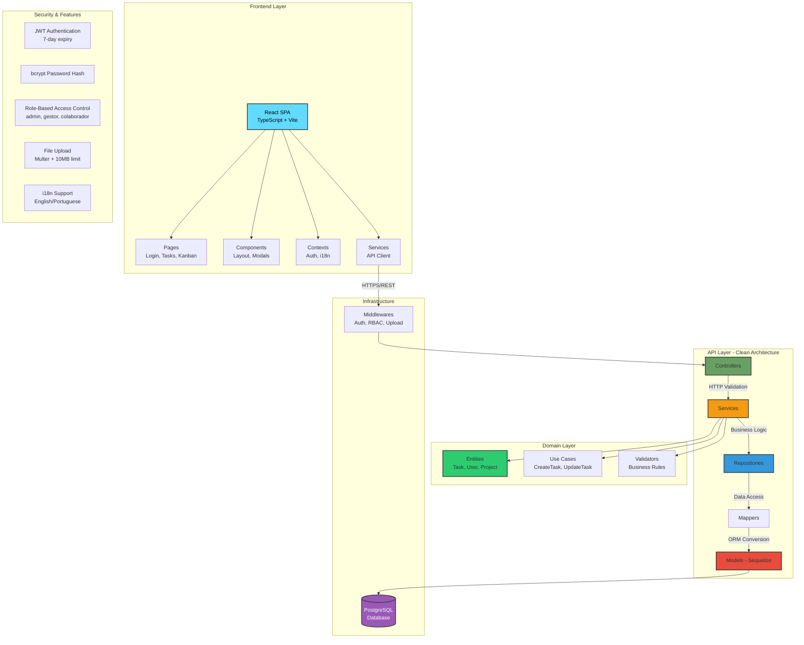
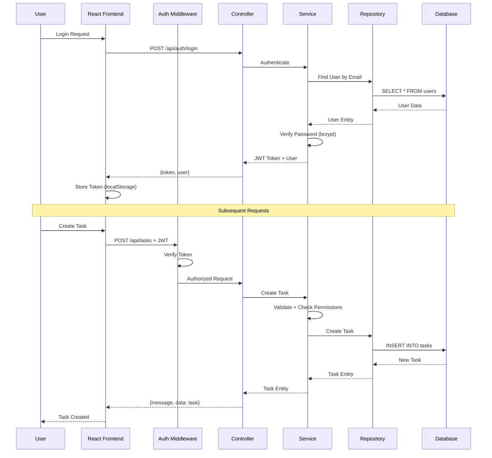
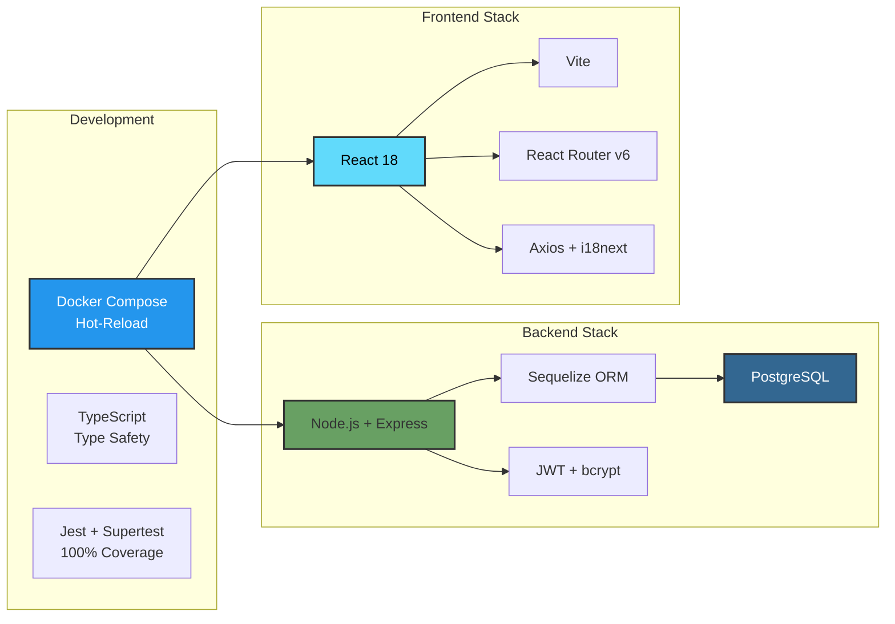

# Task Management System

A full-stack task management application implementing Clean Architecture with Role-Based Access Control.

**Repository:** https://github.com/oguarni/status-point.git

## 🚀 Quick Start (Docker)

```bash
# Clone and start
git clone https://github.com/oguarni/status-point.git
cd status-point
docker compose up

# Access the application
# Frontend: http://localhost:3000
# Backend API: http://localhost:3001
```

### Test Accounts

| Role | Email | Password |
|------|-------|----------|
| Admin | admin@taskmanager.com | admin123 |
| Manager | gestor@taskmanager.com | gestor123 |
| Developer | colaborador@taskmanager.com | colaborador123 |

## 📋 Features

### Core Functionality
- ✅ User authentication (JWT + bcrypt)
- ✅ Role-based access control (admin, gestor, colaborador)
- ✅ Task CRUD operations with authorization
- ✅ Project management
- ✅ Task comments and attachments
- ✅ Task history tracking
- ✅ Kanban board view
- ✅ **Internationalization (i18n)** - English/Portuguese language support with dropdown selector

### Technical Highlights
- ✅ Clean Architecture with SOLID principles
- ✅ Domain-Driven Design patterns
- ✅ 100% test coverage in Services layer
- ✅ Docker Compose with hot-reload
- ✅ Comprehensive API documentation
- ✅ Multi-language support (react-i18next)

## 🛠️ Tech Stack

**Backend:** Node.js, Express, TypeScript, PostgreSQL, Sequelize
**Frontend:** React 18, TypeScript, Vite, React Router v6
**DevOps:** Docker, Docker Compose
**Testing:** Jest, Supertest

## 📁 Project Structure

```
.
├── backend/              # Node.js + Express API
│   ├── src/
│   │   ├── domain/      # Business entities
│   │   ├── usecases/    # Application logic
│   │   ├── services/    # Business logic (100% coverage)
│   │   ├── repositories/# Data access layer
│   │   ├── controllers/ # API endpoints
│   │   ├── mappers/     # ORM ↔ Domain conversion
│   │   └── models/      # Sequelize ORM
│   └── scripts/         # Database seeding & testing
│
├── frontend/            # React SPA
│   └── src/
│       ├── pages/       # Page components
│       ├── components/  # Reusable components
│       ├── contexts/    # React contexts
│       └── services/    # API clients
│
├── docs/                # Architecture diagrams (C4)
├── docker-compose.yml   # Docker orchestration
└── CLAUDE.md           # Comprehensive developer guide
```

## 🏗️ Architecture

This project follows **Clean Architecture** with 4 layers:

1. **Domain Layer** - Pure business entities (Task, User, Project)
2. **Use Cases Layer** - Application-specific business rules
3. **Interface Adapters** - Controllers, repositories, mappers
4. **Infrastructure** - Framework implementations (Express, Sequelize)

### Architecture Diagram



### Data Flow



### Technology Stack Architecture



### C4 Diagrams

Static architecture diagrams are also available:
- 
- 
- 

## 🧪 Testing

```bash
cd backend

# Run all tests
npm test

# Watch mode
npm run test:watch

# Coverage report
npm run test:coverage
```

**Current Coverage:** 100% in Services layer

## 📚 API Endpoints

### Authentication
- `POST /api/auth/register` - Register new user
- `POST /api/auth/login` - Login

### Tasks (Protected)
- `GET /api/tasks` - List user's tasks
- `POST /api/tasks` - Create task
- `PUT /api/tasks/:id` - Update task
- `PATCH /api/tasks/:id/complete` - Mark complete
- `DELETE /api/tasks/:id` - Delete task

### Projects (Protected)
- `GET /api/projects` - List projects
- `POST /api/projects` - Create project (admin/gestor only)
- `PUT /api/projects/:id` - Update project
- `DELETE /api/projects/:id` - Delete project

*Full API documentation in [CLAUDE.md](./CLAUDE.md#api-endpoints)*

## ⚙️ Manual Setup (Without Docker)

<details>
<summary>Click to expand manual setup instructions</summary>

### Prerequisites
- Node.js v18+
- PostgreSQL v12+

### Backend

```bash
cd backend
npm install

# Create database
psql -U postgres -c "CREATE DATABASE task_management_dev;"

# Configure .env
cp .env.example .env
# Edit .env with your database credentials

# Run migrations
npm run db:migrate

# Start server
npm run dev
```

### Frontend

```bash
cd frontend
npm install
npm run dev
```

</details>

## 📖 Documentation

- **[CLAUDE.md](./CLAUDE.md)** - Comprehensive guide for developers and AI assistants
  - Detailed architecture explanations
  - Code patterns and conventions
  - Testing strategies
  - Common tasks and workflows

## 🎓 Academic Context

- **Course:** Software Engineering, 7th semester
- **Institution:** UTFPR (Federal University of Technology - Paraná)
- **Purpose:** Demonstrate Clean Architecture implementation
- **Achievements:**
  - ✅ 10+ functional requirements (5 minimum required)
  - ✅ Clean Architecture with SOLID
  - ✅ 100% service layer test coverage
  - ✅ Role-Based Access Control
  - ✅ Advanced features (comments, attachments, history)

## 📄 License

MIT License - see [LICENSE](./LICENSE) file for details.

Educational project for UTFPR Software Engineering course.

## 👤 Author

7th-semester Software Engineering student, UTFPR

---

**Need more details?** Check [CLAUDE.md](./CLAUDE.md) for comprehensive documentation.
