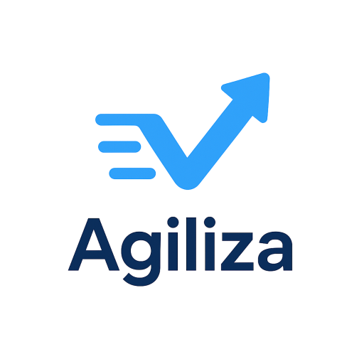

<h1 align="center">
  
  <br>
  Sistema de Gestão de Tarefas
</h1>
<p align="center">
<strong>Arquitetura Limpa | SOLID | DDD | RBAC</strong>
</p>

<p align="center">
<a href="#-sobre-o-projeto">Sobre</a> •
<a href="#-processo-de-desenvolvimento">Desenvolvimento</a> •
<a href="#-funcionalidades-entregues-mvp">Funcionalidades</a> •
<a href="#-arquitetura-e-modelagem">Arquitetura</a> •
<a href="#-instalação-e-execução">Instalação</a> •
<a href="#-documentação">Documentação</a>
</p>

## 📖 Sobre o Projeto

O **Agiliza** constitui uma solução full-stack destinada ao gerenciamento de projetos e tarefas, concebida com ênfase na qualidade arquitetural e na escalabilidade do sistema. A plataforma possibilita que equipes organizem seus fluxos de trabalho por meio de quadros Kanban, implementando um controle rigoroso de permissões e assegurando a rastreabilidade das ações executadas.

O desenvolvimento deste projeto obedeceu a um ciclo de vida completo de engenharia de software, abrangendo desde o levantamento inicial de requisitos e regras de negócio até a implementação do Produto Mínimo Viável (MVP) e a elaboração da documentação arquitetural.

## 📅 Processo de Desenvolvimento

A estruturação do projeto seguiu um cronograma progressivo de cinco semanas, conforme detalhado a seguir:

### Semana 1: Definição do Negócio

- Levantamento e registro das Regras de Negócio (RN).
- Mapeamento dos usuários potenciais e definição dos papéis da equipe (Administrador, Gestor, Colaborador).
- Configuração do GitHub Projects para o gerenciamento ágil das atividades.

### Semana 2: Requisitos

- Detalhamento dos Requisitos Funcionais, organizados em Épicos e Histórias de Usuário.
- Definição dos Requisitos Não Funcionais, com foco em segurança, desempenho e internacionalização (i18n).

### Semana 3: Modelagem

- Elaboração dos diagramas arquiteturais utilizando o Modelo C4.
- Modelagem do Banco de Dados Relacional.
- Definição da Stack Tecnológica a ser utilizada.

### Semanas 4 e 5: Desenvolvimento do MVP

- Implementação do Backend seguindo os princípios da Clean Architecture.
- Implementação do Frontend como uma Single Page Application (SPA) em React.
- Execução de testes e integração dos componentes.

## 🚀 Funcionalidades Entregues (MVP)

O sistema contempla mais de cinco funcionalidades completas, abrangendo todas as camadas da aplicação, conforme descrito abaixo:

### 1. Autenticação e Controle de Acesso (RBAC)

- Implementação de login e registro seguros utilizando JWT e Bcrypt.
- **Administrador:** Permissão para o gerenciamento integral de usuários e do sistema.
- **Gestor:** Permissão para a criação e gestão de projetos e equipes.
- **Colaborador:** Permissão para a gestão de tarefas próprias e interação nas mesmas.

### 2. Gestão de Projetos

- Operações CRUD (Create, Read, Update, Delete) completas para projetos.
- Definição de prazos e monitoramento de status (Atrasado/Urgente).
- Associação de gestores responsáveis por cada projeto.

### 3. Gestão de Tarefas e Kanban

- Criação e edição de tarefas com atribuição de prioridades.
- **Quadro Kanban Interativo:** Funcionalidade de drag-and-drop para alteração de status (A Fazer, Em Progresso, Concluído, Bloqueado).
- Registro histórico automático das alterações de status.

### 4. Colaboração e Detalhes

- Sistema de Comentários em tempo real nas tarefas.
- Upload de Anexos (arquivos e imagens) vinculado às tarefas específicas.

### 5. Busca e Filtros Avançados

- Filtragem dinâmica por Status, Prioridade e Projeto.
- Busca textual por título e descrição da tarefa.

### Extra

- **Internacionalização (i18n):** Suporte integral aos idiomas Português (BR) e Inglês (EN).

## 🏗️ Arquitetura e Modelagem

O projeto adota estritamente a **Clean Architecture**, segmentando o backend em camadas desacopladas:

1. **Enterprise Business Rules (Domain):** Entidades puras (Task, User, Project).
2. **Application Business Rules (Use Cases/Services):** Lógica de aplicação e regras de negócio.
3. **Interface Adapters (Controllers, Repositories):** Mecanismos de conversão de dados.
4. **Frameworks & Drivers (Infrastructure):** Banco de dados, Servidor Web e ferramentas externas.

### Artefatos Disponíveis

- **Modelo C4:** Disponível no diretório `docs/diagrams/` (Contexto, Contêiner, Componentes).
- **Modelo ER:** Diagrama de Entidade-Relacionamento do banco de dados PostgreSQL.


## 🛠️ Stack Tecnológica

| Camada | Tecnologia | Detalhes |
|--------|------------|----------|
| Backend | Node.js + TypeScript | Express, tsyringe (Injeção de Dependência), Multer |
| Banco de Dados | PostgreSQL | ORM Sequelize, Migrations, Seeds |
| Frontend | React 18 | Vite, TypeScript, TailwindCSS, Context API |
| DevOps | Docker | Docker Compose para orquestração de contêineres |
| Testes | Jest | Testes unitários e de integração |

## 📦 Instalação e Execução

### Pré-requisitos

- Docker e Docker Compose instalados no ambiente de execução.

### Início Rápido (Recomendado)

1. **Clonar o repositório:**

```bash
git clone https://github.com/oguarni/status-point.git
cd status-point
```

2. **Inicializar o ambiente com Docker:**

```bash
docker compose up --build -d
```

3. **Popular o banco de dados (Seeds):**
   Criação de usuários padrão e inserção de dados de teste.

```bash
docker compose exec backend npm run db:seed:all
```

4. **Acessar a aplicação:**
   - Frontend: http://localhost:3000
   - Backend API: http://localhost:3001

### Credenciais de Teste

| Papel | Email | Senha |
|-------|-------|-------|
| Administrador | admin@taskmanager.com | admin123 |
| Gestor | gestor@taskmanager.com | gestor123 |
| Colaborador | colaborador@taskmanager.com | colaborador123 |

## 📄 Documentação

- **Requisitos e Regras de Negócio:** Consultar [Relatório Final](./RELATÓRIO_FINAL_PROJETO_AGILIZA.md)
- **Documentação de Desenvolvimento:** Consultar [CLAUDE.md](./CLAUDE.md)
- **Diagramas de Arquitetura:** Disponíveis no diretório `docs/diagrams/`

## 🎓 Contexto Acadêmico

Este projeto foi desenvolvido como requisito final da disciplina de **Arquitetura de Software (AS27S)**, do curso de Engenharia de Software da **Universidade Tecnológica Federal do Paraná (UTFPR)**, campus Dois Vizinhos.

### Autores

- Aurélio Antonio Brites de Miranda
- Gabriel Felipe Guarnieri

## 📄 Licença

Licença MIT - veja o arquivo [LICENSE](./LICENSE) para detalhes.
