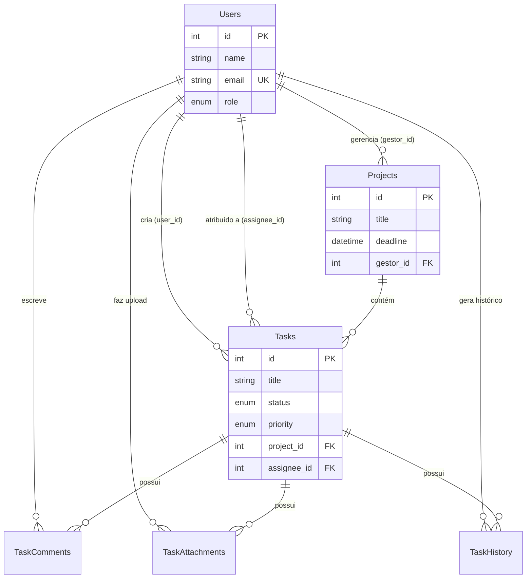

# Relatório Final de Entrega - Projeto Agiliza

**Disciplina:** Arquitetura de Software

**Projeto:** Sistema de Gerenciamento de Tarefas (Agiliza)

---

## 1. Visão Geral

O Agiliza é um sistema full-stack de gerenciamento de tarefas e projetos, desenvolvido para demonstrar a aplicação prática de **Clean Architecture**, princípios **SOLID** e **Domain-Driven Design (DDD)**. O sistema permite que equipes organizem fluxos de trabalho através de quadros Kanban, com controle de acesso hierárquico.

---

## 2. Semana 1: Regras de Negócio e Papéis

### 2.1. Papéis Definidos (RBAC)

O sistema implementa um **Controle de Acesso Baseado em Papel** (Role-Based Access Control) com três níveis hierárquicos:

**Administrador (admin):**
- Possui acesso irrestrito a todo o sistema.
- Pode criar e gerenciar outros usuários e atribuir papéis.
- Visualiza e gerencia todos os projetos e tarefas.

**Gestor (gestor):**
- Foco no nível tático/gerencial.
- Pode criar, editar e excluir Projetos.
- Pode visualizar tarefas de sua equipe e gerar relatórios.

**Colaborador (colaborador):**
- Foco operacional.
- Pode criar e gerenciar suas próprias Tarefas.
- Não tem permissão para criar ou excluir Projetos.
- Pode interagir (comentar/anexar) em tarefas atribuídas a ele.

### 2.2. Regras de Negócio Principais

- **RN01 - Unicidade de E-mail:** Não é permitido o cadastro de dois usuários com o mesmo endereço de e-mail.
- **RN02 - Propriedade de Tarefa:** Apenas o criador da tarefa (ou um Admin) pode excluí-la, garantindo a integridade do histórico de trabalho.
- **RN03 - Fluxo de Status:** As tarefas devem seguir um fluxo lógico de estados (`todo` -> `in_progress` -> `completed`), embora o sistema permita flexibilidade via Kanban.
- **RN04 - Segurança de Projetos:** Apenas usuários com perfil `gestor` ou superior podem instanciar novos projetos no sistema.

### 2.3. Ferramenta de Gerenciamento

A equipe utilizou o **GitHub Projects** para organização das Sprints, adotando a metodologia Kanban para o fluxo de desenvolvimento das features.

---

## 3. Semana 2: Detalhamento dos Requisitos

### 3.1. Requisitos Funcionais (RF)

O sistema atende aos seguintes requisitos funcionais, organizados por Épicos:

**Épico 01: Autenticação e Gestão de Usuários**
- **RF01:** O sistema deve permitir o registro de novos usuários (papel padrão: Colaborador).
- **RF02:** O sistema deve permitir o login via e-mail e senha (autenticação JWT).

**Épico 02: Gestão de Projetos**
- **RF03:** O usuário Gestor/Admin deve conseguir criar, editar, listar e excluir Projetos.
- **RF04:** O sistema deve validar prazos de projetos (não permitir datas passadas na criação).

**Épico 03: Gestão de Tarefas (Core)**
- **RF05:** O usuário deve conseguir criar tarefas com Título, Descrição, Prioridade e Prazo.
- **RF06:** O usuário deve conseguir visualizar suas tarefas em formato de lista ou Quadro Kanban.
- **RF07:** O sistema deve permitir arrastar e soltar (drag-and-drop) tarefas para mudar seu status (A Fazer, Em Progresso, Concluído, Bloqueado).
- **RF08:** O usuário deve conseguir filtrar tarefas por Status, Prioridade ou Projeto.

**Épico 04: Colaboração**
- **RF09:** O usuário deve conseguir adicionar comentários em uma tarefa.
- **RF10:** O sistema deve permitir o upload de anexos (arquivos) em uma tarefa.

### 3.2. Requisitos Não Funcionais (RNF)

- **RNF01 - Arquitetura:** O backend deve seguir estritamente a Clean Architecture, isolando o domínio de frameworks externos.
- **RNF02 - Segurança:** As senhas devem ser armazenadas com hash (bcrypt) e a API deve ser protegida por tokens JWT.
- **RNF03 - Internacionalização (i18n):** O frontend deve suportar múltiplos idiomas (Português e Inglês).
- **RNF04 - Portabilidade:** O sistema deve ser empacotado em contêineres Docker para fácil implantação.
- **RNF05 - Tecnologia:**
  - Backend: Node.js + TypeScript + Express + Sequelize.
  - Frontend: React + TypeScript + TailwindCSS.
  - Banco de Dados: PostgreSQL.

---

## 4. Semana 3: Modelagem Arquitetural

### 4.1. Modelo C4

A documentação arquitetural segue o modelo C4, conforme diagramas gerados na pasta `docs/diagrams/`:

- **Nível 1 (Contexto):** Demonstra a interação do Usuário com o Sistema Agiliza.
- **Nível 2 (Contêineres):** Detalha a separação entre Frontend (SPA), Backend (API) e Database.
- **Nível 3 (Componentes):** Explode o Backend API para mostrar as camadas da Clean Architecture.

### 4.2. Diagrama de Banco de Dados (DER)

O esquema relacional foi implementado em PostgreSQL utilizando Sequelize. Abaixo o diagrama Entidade-Relacionamento gerado a partir dos modelos:



> **Nota:** O diagrama completo com atributos detalhados está disponível no arquivo `docs/diagrams/database_schema.mermaid`.

---

## 5. Semana 4 e 5: Desenvolvimento do MVP (Entregáveis)

O desenvolvimento atingiu e superou a meta de 5 funcionalidades completas.

### Funcionalidades Entregues (Status: ✅ Concluído)

1. **Sistema de Login e Registro Seguro:** Backend seguro com JWT e Frontend responsivo.
2. **CRUD de Projetos com Validação de Papel:** Regra de negócio onde apenas gestores gerenciam projetos.
3. **Quadro Kanban Interativo:** Visualização visual das tarefas com Drag-and-Drop.
4. **Sistema de Busca e Filtros Avançados:** Filtros por texto, prioridade e status via SQL otimizado.
5. **Anexos e Uploads:** Gestão de arquivos vinculados a tarefas.
6. **Internacionalização:** Suporte completo a PT-BR e EN.

---

## 6. Procedimentos de Operação (Deploy)

O projeto utiliza Docker para padronização de ambiente.

### Pré-requisitos

- Docker e Docker Compose.

### Como Rodar

1. **Clonar o repositório:**
   ```bash
   git clone https://github.com/oguarni/status-point.git
   ```

2. **Subir a aplicação:**
   ```bash
   docker-compose up --build -d
   ```

3. **Acessar:**
   - Frontend: `http://localhost:3000`
   - API: `http://localhost:3001`

---

## Autores

- Gabriel Felipe Guarnieri
- Aurélio Antonio Brites de Miranda

**Data:** Dezembro/2025
