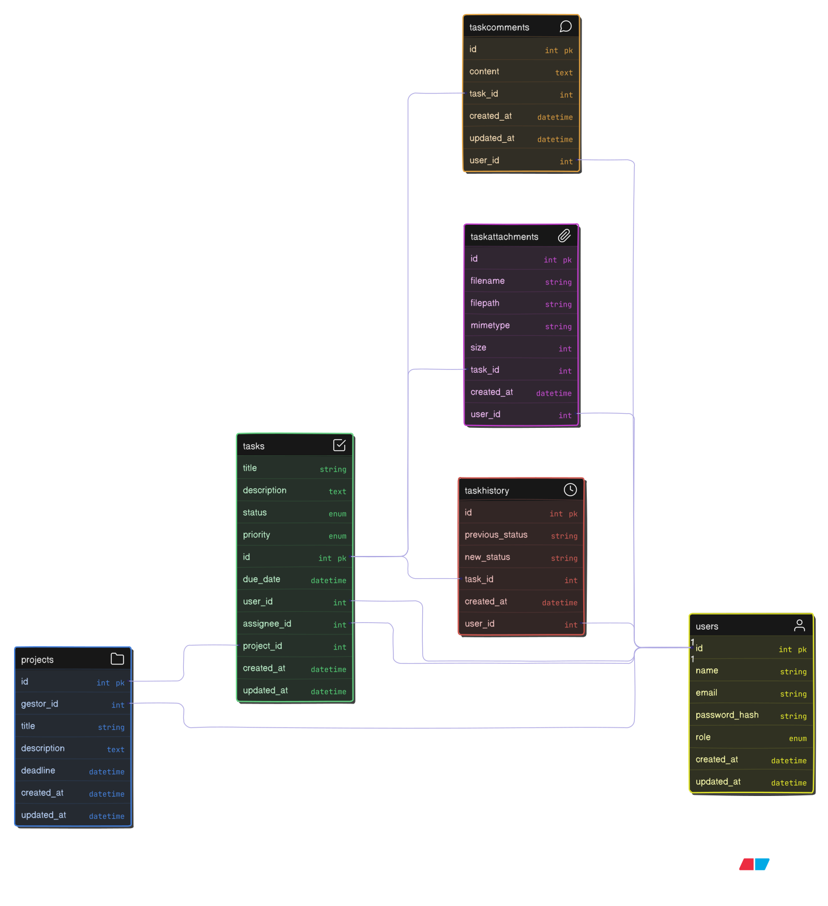

# Relatório Final de Entrega - Projeto Agiliza

**Disciplina:** Arquitetura de Software

**Projeto:** Sistema de Gerenciamento de Tarefas (Agiliza)

**Autores:** Gabriel Felipe Guarnieri, Aurélio Antonio Brites de Miranda

**Data:** Dezembro/2025

---

## 1. Visão Geral do Projeto

O Agiliza é um sistema full-stack de gerenciamento de tarefas e projetos, projetado para facilitar a organização de fluxos de trabalho em equipes. O desenvolvimento do sistema seguiu um cronograma de 5 semanas, aplicando rigorosamente os conceitos de **Clean Architecture**, princípios **SOLID** e **Domain-Driven Design (DDD)**.

O objetivo foi entregar um **MVP (Produto Mínimo Viável)** robusto, seguro e escalável, com suporte a múltiplos idiomas e conteinerização.

---

## 2. Semana 1: Definição de Negócio e Organização

Nesta etapa inicial, foram mapeados os usuários, definidos os papéis de acesso e estabelecidas as regras de negócio fundamentais.

### 2.1. Mapeamento de Usuários e Papéis (RBAC)

O sistema implementa um **Controle de Acesso Baseado em Papel** (Role-Based Access Control) com três níveis hierárquicos:

**Administrador (admin):**
- **Perfil:** Gestor do sistema ou TI.
- **Permissões:** Acesso irrestrito. Pode criar/gerenciar usuários, atribuir papéis e visualizar todos os projetos.

**Gestor (gestor):**
- **Perfil:** Líderes de equipe ou gerentes de projeto (Nível Tático).
- **Permissões:** Criar, editar e excluir Projetos. Visualiza tarefas da equipe e gera relatórios.

**Colaborador (colaborador):**
- **Perfil:** Membros da equipe (Nível Operacional).
- **Permissões:** Criar e gerenciar suas próprias Tarefas. Interagir (comentar/anexar) em tarefas atribuídas. Não pode criar Projetos.

### 2.2. Regras de Negócio (RN)

- **RN01 - Unicidade de E-mail:** O sistema impede o cadastro duplicado de e-mails para garantir a integridade da identidade do usuário.
- **RN02 - Propriedade de Tarefa:** Apenas o criador da tarefa (ou um Admin) possui permissão para excluí-la definitivamente.
- **RN03 - Fluxo de Status:** As tarefas devem transitar por estados lógicos (`todo` → `in_progress` → `completed` ou `blocked`).
- **RN04 - Segurança de Projetos:** A instanciação de novos Projetos é restrita a usuários com perfil `gestor` ou superior.

### 2.3. Ferramenta de Gerenciamento

- **Ferramenta:** GitHub Projects.
- **Metodologia:** Kanban para gestão do fluxo de desenvolvimento (To Do, In Progress, Done).

---

## 3. Semana 2: Detalhamento de Requisitos

Os requisitos foram refinados e organizados em Épicos e Histórias de Usuário para orientar o desenvolvimento.

### 3.1. Requisitos Funcionais (Épicos e Histórias)

**Épico 01: Autenticação e Identidade**
- **US01 (Registro):** Como um visitante, eu quero criar uma conta no sistema para poder gerenciar minhas tarefas.
- **US02 (Login):** Como um usuário registrado, eu quero me autenticar com e-mail e senha para acessar meus dados de forma segura via JWT.

**Épico 02: Gestão de Projetos**
- **US03 (CRUD Projetos):** Como um Gestor, eu quero criar, editar e excluir projetos para organizar as demandas da minha equipe.
- **US04 (Prazos):** Como um Gestor, eu quero definir prazos (deadlines) para os projetos, garantindo que o sistema valide datas futuras.

**Épico 03: Gestão de Tarefas (Core)**
- **US05 (Criação):** Como um usuário, eu quero criar tarefas com título, descrição, prioridade e prazo.
- **US06 (Kanban):** Como um usuário, eu quero visualizar minhas tarefas em um quadro Kanban para entender rapidamente o status do trabalho.
- **US07 (Drag-and-Drop):** Como um usuário, eu quero arrastar cartões entre colunas para atualizar o status da tarefa intuitivamente.
- **US08 (Filtros):** Como um usuário, eu quero filtrar tarefas por status, prioridade ou projeto para encontrar itens específicos.

**Épico 04: Colaboração**
- **US09 (Comentários):** Como um Colaborador, eu quero comentar em tarefas para registrar o progresso ou tirar dúvidas.
- **US10 (Anexos):** Como um Colaborador, eu quero fazer upload de arquivos nas tarefas para compartilhar documentos relevantes.

### 3.2. Requisitos Não Funcionais (RNF)

- **RNF01 - Arquitetura:** O backend deve seguir estritamente a Clean Architecture.
- **RNF02 - Segurança:** Senhas criptografadas com bcrypt e rotas protegidas por JWT.
- **RNF03 - Internacionalização (i18n):** Suporte a múltiplos idiomas (PT-BR / EN) com troca em tempo real.
- **RNF04 - Portabilidade:** Empacotamento via Docker para garantir execução em qualquer ambiente.
- **RNF05 - Interface:** Design responsivo utilizando TailwindCSS.

---

## 4. Semana 3: Modelagem Arquitetural e Tecnológica

### 4.1. Stack Tecnológica

| Camada | Tecnologias |
|--------|-------------|
| **Frontend** | React 18 + TypeScript + Vite + TailwindCSS |
| **Backend** | Node.js + TypeScript + Express + Sequelize (ORM) |
| **Banco de Dados** | PostgreSQL 15 |
| **Infraestrutura** | Docker e Docker Compose |

### 4.2. Modelagem C4

A arquitetura foi documentada utilizando o modelo C4 (diagramas disponíveis em `docs/diagrams/`):

**Nível 1 - Contexto do Sistema:**


**Nível 2 - Contêineres:**


**Nível 3 - Componentes (Backend):**


### 4.3. Diagrama de Banco de Dados (ER)

O banco de dados relacional foi modelado com as seguintes entidades principais:



**Entidades:**
- **Users:** `id`, `name`, `email`, `password_hash`, `role`.
- **Projects:** `id`, `title`, `deadline`, `gestor_id` (FK).
- **Tasks:** `id`, `title`, `status`, `priority`, `project_id` (FK), `user_id` (FK).
- **TaskAttachments / TaskComments / TaskHistory:** Tabelas de suporte.

---

## 5. Semana 4 e 5: Desenvolvimento do MVP

O desenvolvimento resultou na entrega de um sistema funcional, versionado no GitHub e superando a meta de 5 funcionalidades.

### Funcionalidades Entregues (Status: ✅ Concluído)

1. **Autenticação Robusta:** Sistema completo de Login/Registro com validação de dados e segurança JWT.
2. **Gestão de Projetos (RBAC):** Implementação de regras onde apenas Gestores podem administrar projetos.
3. **Quadro Kanban Interativo:** Interface visual com Drag-and-Drop para movimentação de tarefas entre colunas (A Fazer, Em Progresso, Concluído, Bloqueado).
4. **Sistema de Busca e Filtros:** Pesquisa textual e filtros dinâmicos (SQL ILIKE) por prioridade e status.
5. **Gerenciamento de Anexos:** Upload de arquivos utilizando Multer no backend.
6. **Internacionalização (Extra):** Sistema completo de tradução (Inglês/Português).

### Versionamento

O código está organizado em um monorepo (`backend/` e `frontend/`) e hospedado no GitHub/GitLab conforme requisitos.

---

## 6. Procedimentos de Operação (Deploy)

O projeto é "Docker-first", eliminando problemas de configuração de ambiente.

### Como Rodar a Aplicação

**Pré-requisitos:** Docker e Docker Compose instalados.

1. **Clonar o repositório:**
   ```bash
   git clone https://github.com/oguarni/status-point.git
   cd status-point
   ```

2. **Iniciar a aplicação (Build + Up):**
   ```bash
   docker-compose up --build -d
   ```

3. **Popular o Banco de Dados (Seeds):**
   Cria usuários (admin, gestor, colaborador) e dados de teste.
   ```bash
   docker-compose exec backend npm run db:seed:all
   ```

4. **Acessar:**
   - Frontend: `http://localhost:3000`
   - Backend API: `http://localhost:3001`

### Credenciais de Acesso (Seeds)

| Papel | E-mail | Senha |
|-------|--------|-------|
| Admin | admin@taskmanager.com | admin123 |
| Gestor | gestor@taskmanager.com | gestor123 |
| Colaborador | colaborador@taskmanager.com | colaborador123 |
