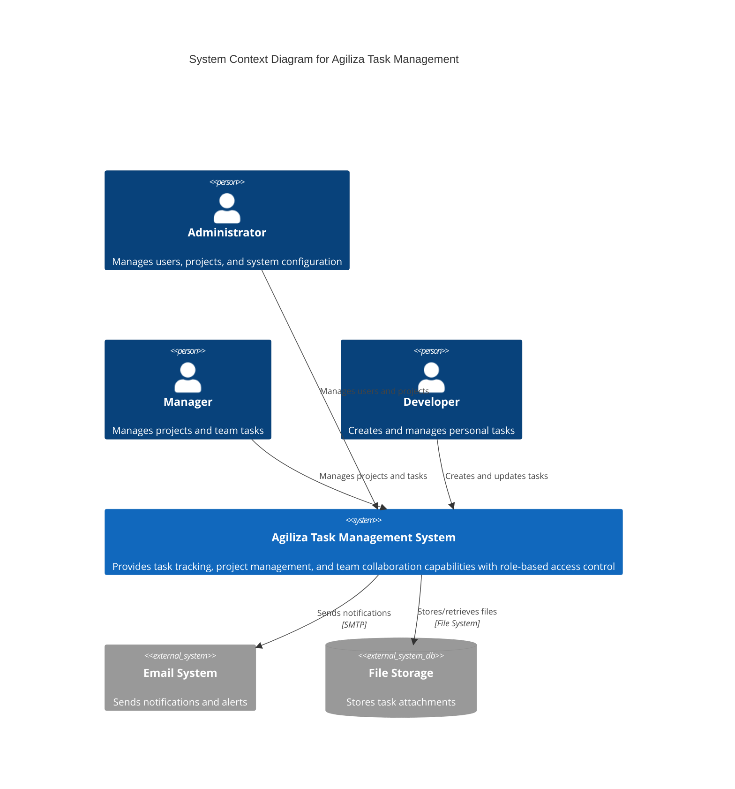

# C4 Model - Level 1: System Context Diagram

## Agiliza Task Management System

This diagram shows the high-level system context of the Agiliza Task Management System and its interactions with users and external systems.

### Key Elements

- **Users**: Three role-based actors (Administrator, Manager, Developer)
- **Agiliza System**: Central task management platform
- **External Systems**:
  - Email System: For notifications (future enhancement)
  - File Storage: For task attachments

### Interactions

- Administrators manage users, projects, and system configuration
- Managers oversee projects and assign tasks to team members
- Developers create and track their own tasks
- The system integrates with external services for notifications and file storage
