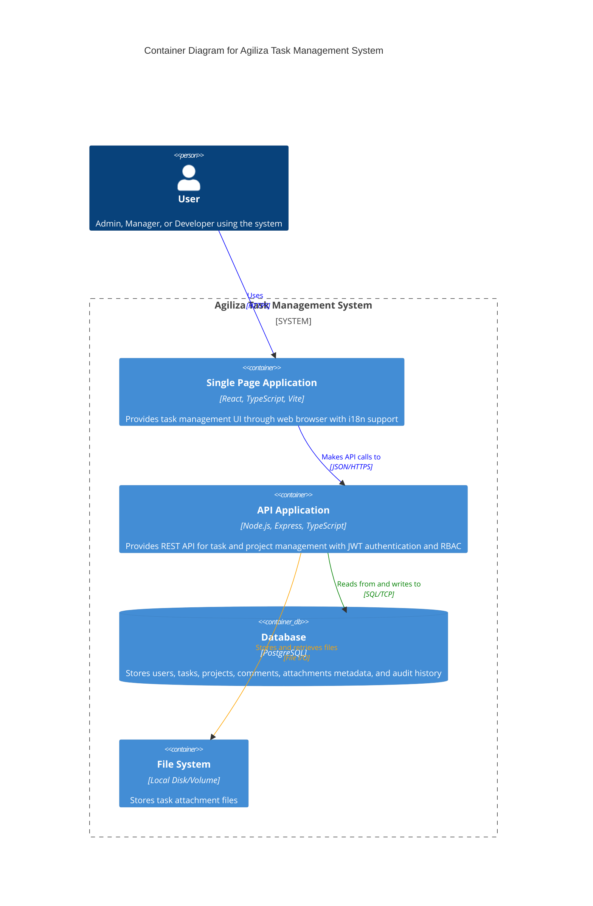

# C4 Model - Level 2: Container Diagram

## Agiliza Task Management System - Containers

This diagram shows the containers (applications and data stores) that make up the Agiliza system and how they interact.

### Container Descriptions

#### 1. Single Page Application (SPA)
- **Technology**: React 18, TypeScript, Vite, TailwindCSS
- **Purpose**: Provides the user interface for task management
- **Features**:
  - Kanban board view
  - Task CRUD operations
  - Project management
  - Comments and attachments
  - Internationalization (PT-BR/EN)
  - Role-based UI elements

#### 2. API Application
- **Technology**: Node.js, Express, TypeScript
- **Purpose**: Business logic and data access layer
- **Features**:
  - RESTful API endpoints
  - JWT authentication
  - Role-Based Access Control (RBAC)
  - Clean Architecture implementation
  - Request validation
  - Error handling

#### 3. Database
- **Technology**: PostgreSQL with Sequelize ORM
- **Purpose**: Persistent data storage
- **Stores**:
  - User accounts and roles
  - Tasks and projects
  - Comments and task history
  - Attachment metadata

#### 4. File System
- **Technology**: Local disk storage (Docker volume)
- **Purpose**: Stores uploaded task attachments
- **Features**:
  - Multer file upload handling
  - Unique filename generation
  - 10MB file size limit

### Communication Patterns

- **User ↔ SPA**: HTTPS for secure web access
- **SPA ↔ API**: JSON over HTTPS with JWT tokens
- **API ↔ Database**: SQL queries via Sequelize ORM
- **API ↔ File System**: Direct file I/O operations
