# C4 Model - Level 3: Component Diagram (Backend)

## Agiliza API Application - Components

This diagram shows the internal components of the API application and how they implement Clean Architecture principles.

```mermaid
C4Component
    title Component Diagram for Agiliza API Application (Backend)

    Container(spa, "Single Page Application", "React, TypeScript", "Provides UI for task management")
    ContainerDb(db, "Database", "PostgreSQL", "Stores application data")
    Container(fileSystem, "File System", "Local Disk", "Stores attachments")

    Container_Boundary(api, "API Application") {
        Component(router, "Router", "Express Router", "Routes HTTP requests to appropriate controllers")
        Component(middleware, "Middleware", "Express Middleware", "Authentication, authorization, validation, error handling")

        Component(authController, "Auth Controller", "TypeScript Class", "Handles authentication endpoints (login, register)")
        Component(taskController, "Task Controller", "TypeScript Class", "Handles task CRUD endpoints")
        Component(projectController, "Project Controller", "TypeScript Class", "Handles project management endpoints")
        Component(commentController, "Comment Controller", "TypeScript Class", "Handles task comment endpoints")
        Component(attachmentController, "Attachment Controller", "TypeScript Class", "Handles file attachment endpoints")

        Component(authService, "Auth Service", "TypeScript Class", "Business logic for authentication and authorization")
        Component(taskService, "Task Service", "TypeScript Class", "Business logic for task management with RBAC")
        Component(projectService, "Project Service", "TypeScript Class", "Business logic for project management")
        Component(commentService, "Comment Service", "TypeScript Class", "Business logic for comments")
        Component(attachmentService, "Attachment Service", "TypeScript Class", "Business logic for file attachments")

        Component(userRepo, "User Repository", "TypeScript Class", "Data access for users")
        Component(taskRepo, "Task Repository", "TypeScript Class", "Data access for tasks")
        Component(projectRepo, "Project Repository", "TypeScript Class", "Data access for projects")
        Component(commentRepo, "Comment Repository", "TypeScript Class", "Data access for comments")
        Component(attachmentRepo, "Attachment Repository", "TypeScript Class", "Data access for attachments")

        Component(mapper, "Mappers", "TypeScript Classes", "Converts between domain entities and ORM models")
        Component(domain, "Domain Entities", "TypeScript Classes", "Pure business logic entities (User, Task, Project)")
    }

    Rel(spa, router, "Makes API calls to", "JSON/HTTPS")
    Rel(router, middleware, "Passes through", "Request")

    Rel(middleware, authController, "Routes auth requests")
    Rel(middleware, taskController, "Routes task requests")
    Rel(middleware, projectController, "Routes project requests")
    Rel(middleware, commentController, "Routes comment requests")
    Rel(middleware, attachmentController, "Routes attachment requests")

    Rel(authController, authService, "Uses")
    Rel(taskController, taskService, "Uses")
    Rel(projectController, projectService, "Uses")
    Rel(commentController, commentService, "Uses")
    Rel(attachmentController, attachmentService, "Uses")

    Rel(authService, userRepo, "Uses")
    Rel(taskService, taskRepo, "Uses")
    Rel(taskService, projectRepo, "Uses")
    Rel(projectService, projectRepo, "Uses")
    Rel(commentService, commentRepo, "Uses")
    Rel(attachmentService, attachmentRepo, "Uses")

    Rel(userRepo, mapper, "Uses for conversion")
    Rel(taskRepo, mapper, "Uses for conversion")
    Rel(projectRepo, mapper, "Uses for conversion")

    Rel(mapper, domain, "Creates/converts")

    Rel(userRepo, db, "Reads/writes", "SQL")
    Rel(taskRepo, db, "Reads/writes", "SQL")
    Rel(projectRepo, db, "Reads/writes", "SQL")
    Rel(commentRepo, db, "Reads/writes", "SQL")
    Rel(attachmentRepo, db, "Reads/writes", "SQL")

    Rel(attachmentService, fileSystem, "Stores/retrieves files", "File I/O")

    UpdateLayoutConfig($c4ShapeInRow="3", $c4BoundaryInRow="1")
```

### Clean Architecture Layers

#### 1. Infrastructure Layer (Outer)
**Components**: Router, Middleware, Controllers
- **Router**: Express routing configuration
- **Middleware**:
  - `authMiddleware`: JWT validation
  - `roleMiddleware`: RBAC enforcement
  - `uploadMiddleware`: Multer file upload handling
  - `errorHandler`: Centralized error handling
- **Controllers**: HTTP request/response handling
  - Validate input using express-validator
  - Call appropriate services
  - Format responses

#### 2. Application Layer
**Components**: Services (Business Logic)
- **AuthService**:
  - User registration (always assigns 'colaborador' role)
  - User login with JWT generation
  - Admin user creation (can assign any role)
- **TaskService**:
  - Task CRUD with RBAC
  - Task completion/status updates
  - Project association
- **ProjectService**: Project management (restricted to admin/gestor)
- **CommentService**: Task comment management
- **AttachmentService**: File upload/download/deletion

#### 3. Interface Layer
**Components**: Repositories
- Implement repository interfaces defined in `interfaces/`
- Use Sequelize ORM for database operations
- Depend on Mappers for entity conversion
- **Key Repositories**:
  - `UserRepository`
  - `TaskRepository`
  - `ProjectRepository`
  - `CommentRepository`
  - `AttachmentRepository`

#### 4. Domain Layer (Inner)
**Components**: Domain Entities, Mappers
- **Domain Entities**: Pure TypeScript classes
  - `User`: Business logic for users and roles
  - `Task`: Task entity with validation
  - `Project`: Project entity
  - No dependencies on frameworks
- **Mappers**:
  - `UserMapper`: ORM ↔ Domain conversion
  - `TaskMapper`: ORM ↔ Domain conversion
  - `ProjectMapper`: ORM ↔ Domain conversion

### Key Architectural Patterns

1. **Dependency Inversion**: Services depend on repository interfaces, not implementations
2. **Single Responsibility**: Each component has one clear purpose
3. **Separation of Concerns**: Clear boundaries between layers
4. **Dependency Injection**: Using TypeScript constructors
5. **Repository Pattern**: Abstracts data access
6. **Mapper Pattern**: Separates domain entities from ORM models

### Security Features

- **JWT Authentication**: All protected endpoints require valid JWT tokens
- **Role-Based Access Control (RBAC)**: Three roles with different permissions
  - `admin`: Full system access, user management
  - `gestor`: Project and task management
  - `colaborador`: Personal task management
- **Hardened Registration**: Public registration always assigns 'colaborador' role
- **Input Validation**: express-validator on all endpoints
- **Password Hashing**: bcryptjs with salt rounds
